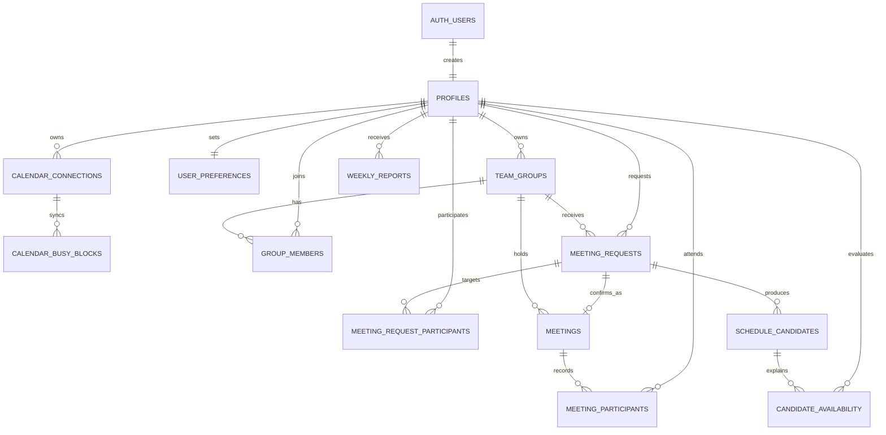

# Database design

## Decision

Use **Supabase Postgres** for the shared application data and Supabase Auth for identity. `auth.users` is the authoritative login table; `public.profiles` is the application-facing user record keyed by the same UUID.

This supports the agreed MVP flow:

```text
Google sign-in -> calendar busy blocks -> group request -> rule-engine candidates
-> AI explanation -> confirmed meeting -> attendance and weekly report
```

## Non-negotiable data boundaries

1. Google Calendar supplies **availability**, not group-visible event content. The app caches only busy start/end blocks needed by the scheduler.
2. `personal_importance` belongs to the **membership**, not the group. A person can treat one group as high priority and another as low priority.
3. Attendance is recorded per confirmed meeting. Attendance rates are derived from those records, not stored as a mutable number on `profiles`.
4. Google sign-in plus Calendar scope does **not** grant Gmail sending permission. The normal MVP delivery is the web app; the optional adjustment-email demo uses a separately consented, opt-in Gmail connection and requires final human confirmation.
5. Access and refresh tokens never belong in client-readable tables. Store them only in secure server-side secret storage; the database keeps connection metadata only.

## ERD



The same model is available as [DBML](erd.dbml) for dbdiagram.io or other ERD tools.

## Tables and purpose

| Table | Purpose | Essential columns |
| --- | --- | --- |
| `profiles` | App user linked one-to-one to Supabase Auth | `id`, `email`, `display_name`, `timezone` |
| `calendar_connections` | Google Calendar connection state only; no OAuth tokens | `user_id`, `granted_scopes`, `sync_status`, `last_synced_at` |
| `calendar_busy_blocks` | Minimal cached availability derived from Google Calendar | `user_id`, `starts_at`, `ends_at`, `source_event_id` |
| `team_groups` | A project, study, or team workspace | `owner_user_id`, `name`, `default_meeting_importance` |
| `group_members` | Membership and each person's importance for that group | `group_id`, `user_id`, `role`, `personal_importance` |
| `user_preferences` | Individual default scheduling preferences | `preferred_period`, `workday_start`, `max_meetings_per_day` |
| `meeting_requests` | Natural-language request plus structured constraints | `raw_request`, `ai_constraints`, `duration_minutes`, `status` |
| `meeting_request_participants` | Required vs optional invitees before a meeting exists | `request_id`, `user_id`, `is_required` |
| `schedule_candidates` | Deterministic rule-engine output, ranked top candidates | `starts_at`, `score`, `score_breakdown`, `rank` |
| `candidate_availability` | Why each person can/cannot make each candidate | `candidate_id`, `user_id`, `availability` |
| `meetings` | User-confirmed event | `source_request_id`, `starts_at`, `status`, `context` |
| `meeting_participants` | RSVP and attendance source of truth | `meeting_id`, `user_id`, `attendance_status`, `is_required` |
| `weekly_reports` | Personal in-app weekly report snapshot | `user_id`, `week_start`, `content`, `delivery_status` |

## Page-to-data contract

| View | Reads | Writes |
| --- | --- | --- |
| `/login` | Auth session only | Supabase Auth Google OAuth; profile trigger creates `profiles` |
| `/me` | `profiles`, `calendar_connections`, `group_members`, `team_groups`, `meetings`, `weekly_reports` | `user_preferences`, report read state |
| `/groups/[groupId]` | `team_groups`, `group_members`, safe profile fields, active `meeting_requests`, `meetings` | group name/member importance through controlled action |
| `/groups/[groupId]/schedule/[requestId]` | request, participants, candidates, candidate availability, attendance summary | request, candidate generation through server route, confirmation |
| `/reports/weekly` | `weekly_reports`, confirmed meetings, attendance summary | report generation/read state |

The fuller request/response contract is in [page-contracts.md](page-contracts.md).

## Rule-engine inputs

The scheduler receives only data it needs:

```ts
type SchedulerInput = {
  request: {
    groupId: string;
    durationMinutes: number;
    dateRange: { start: string; end: string };
    preferredPeriod: "morning" | "afternoon" | "evening" | "any";
    importance: 1 | 2 | 3 | 4 | 5;
  };
  participants: Array<{
    userId: string;
    isRequired: boolean;
    personalImportance: 1 | 2 | 3 | 4 | 5;
    preferredPeriod: "morning" | "afternoon" | "evening" | "any";
    busyBlocks: Array<{ startsAt: string; endsAt: string }>;
    attendanceRate: number;
  }>;
};
```

The rule engine stores the resulting score components in `schedule_candidates.score_breakdown`. The AI receives the top candidates and their reasons; it never fabricates a calendar slot.

## Google integration boundary

For the MVP, request Google Calendar's read-only scope and fetch a bounded week of events after consent. Convert those events to busy blocks in a server route. Supabase documents that provider tokens are intentionally not stored in the project database and must be handled securely by a trusted server if used outside the browser. [Supabase social login docs](https://supabase.com/docs/guides/auth/social-login)

Google Calendar's API models an event with start/end times and attendees, which is enough to generate the private busy blocks the rule engine needs. [Google Calendar API overview](https://developers.google.com/workspace/calendar/api/guides/overview)

## Applying the schema

1. Create a Supabase project and configure Google Auth.
2. Add the Google Calendar read-only scope during the consent flow.
3. Run `supabase/migrations/0001_initial_schema.sql` with the Supabase CLI or SQL editor.
4. Use application API routes with a server-side service role only for calendar sync, candidate generation, confirmation, and report generation. Browser clients rely on Row Level Security.
5. During the hackathon, use fixed mock busy blocks for any teammate who has not completed OAuth.

Do not place access tokens, refresh tokens, service-role keys, or Google client secrets in the database migration, mock data, or Git history.
